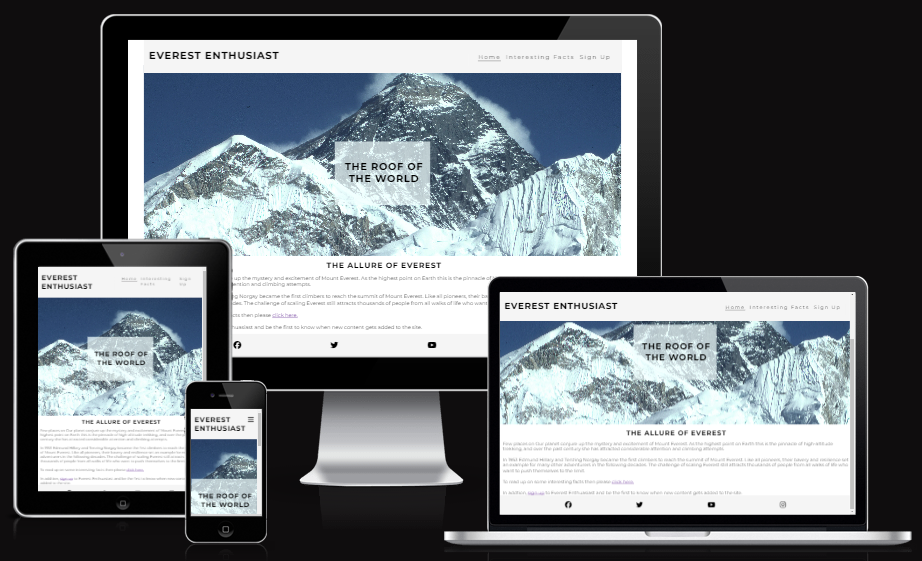

# Everest Enthusiast
## Overview

Everest Enthusiast is a website for those fascinated with the highest mountain on earth - Mount Everest. For decades this mountain nestled in the Himalayas in the remote country of Nepal has caputured the imagination of mankind. Even today, with the advent of modern day travel the mountain still holds an air of mystery. 

As the website grows new content will be added, including more interesting facts, high quality images and a detailed timeline of key events. There will also be video content added which will capture iconic areas of the mountain, such as the various base camps, the Hilary step and the summit itself.

## Features

### Navigation bar

This features links to the three pages of the site, namely:
1. Home
2. Interesting Facts
3. Sign Up 

The navigation bar is responsive, so as the screen size gets smaller the links change to a burger dropdown icon. The format and layout is the same across all three pages which creates a consistent look and feel for the user.

#### Full screen

#### Small sceen

### Home

 

 