# Everest Enthusiast
## Overview
Everest Enthusiast is a website for those fascinated with the highest mountain on earth - Mount Everest and who want to learn more. For decades this mountain nestled in the Himalayas in the remote country of Nepal has caputured the imagination of mankind. Even today, with the advent of modern day travel the mountain still holds an air of mystery. 

As the website grows new content will be added, including more interesting facts, high quality images and a detailed timeline of key events. There will also be video content added which will capture iconic areas of the mountain, such as the various base camps, the Hilary step and the summit itself. For those who aspire to one day climb the mountain, or simply basecamp there will be a section dedicated to the type of kit required. 

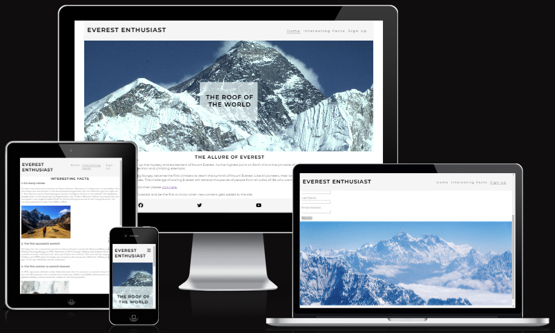

## Features

### Header and navigation bar
This features links to the three pages of the site, namely:
1. Home
2. Interesting Facts
3. Sign Up 

The navigation bar is responsive, so as the screen size gets smaller the links change to a burger dropdown icon. The format and layout is the same across all three pages which creates a consistent look and feel for the user.

The colour used for the navigation is "whitesmoke" which is fitting with the image of Mount Everest which has swirling white cloud around the peak.

The same header is used on each page of the website.

#### Full screen
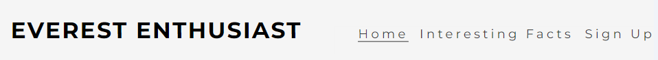

#### Small sceen
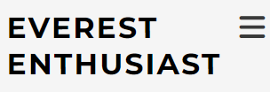

### Home page
#### Top section
The home page has an awe inspiring image of the top of Mount Everest with the cloud swirling around the peak. The image is overlaid with text proclaiming the top of the mountain as the roof of the world.

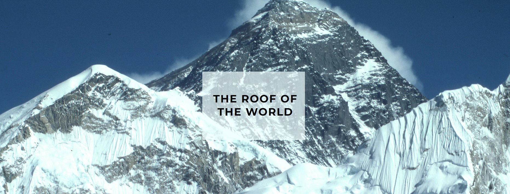

#### Lower section

The bottom half of the page has a title of "The Allure of Everest". There is then a brief overview to draw the viewer in. There are also links to the Interesting Facts and Sign Up pages. 

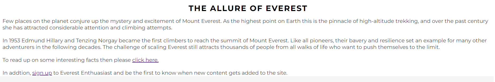

### Footer
The footer has the same colour as the header. There are also links to various social media websites which open on new tabs. The same footer is used on each page of the website.

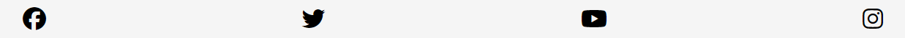

### Interesting Facts page
On this page there are a number of interesting facts about Mount Everest, ranging from the various names the mountain as to the modern day queues of climbers looking to summit the peak. The facts will hopefully include things that alot of people will not be aware of.

Alongside some interesting facts there are some high quality images. 

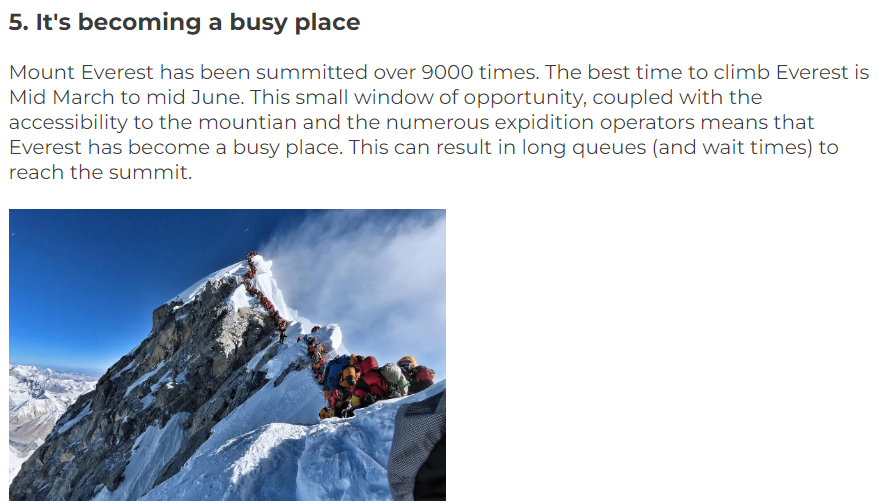

### Sign Up page
For those interested to find out more there is an option to sign up to a mailing list so they can be the first to find out when new content gets added. There is also some bullet points explaining the kind of additional content that will be added in the future. All fields require completing and the Email address field will look for an @ to be included.

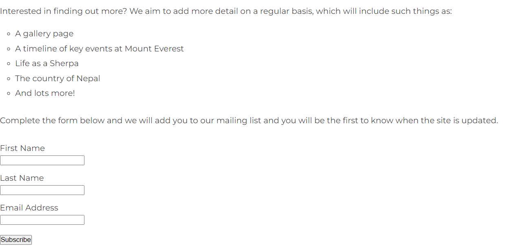

At the bottom of the page is another high quality evocative image of Mount Everest.

## Additional features to include 
The list of additional features to be added at a later date include:

* More interesting facts
* A gallery page 
* A timeline of key events at Mount Everest
* Kit list required for trekking to Base Camp or climging the mountain

## Testing

### Features
|Features|Test Conducted|Expected Outcome|Test Outcome|
|:----|:----|:----|:----|
|Logo|Check to see if takes user back to homepage|User taken to homepage|Pass|
|Navbar-Home|Click on the Home link on each page|User taken to Homepage|Pass|
|Navbar-Interesting Facts|Click on the Interesting Facts link on each page|User taken to Interesting Facts page|Pass|
|Navbar-Sign Up|Click on the Sign Up link on each page|User taken to Sign Up page|Pass|
|Social Media links|Click each link on each page to make sure user is taken to correct site on a new tab|User taken to site in new tab|Pass|

### Browser Compatability
|Browser Tested|Intended Appearance|Test Outcome|
|:----|:----|:----|
|Google Chrome|Good|Pass|
|Edge|Good|Pass|
|Firefox|Good|Pass|

#### Chrome test output
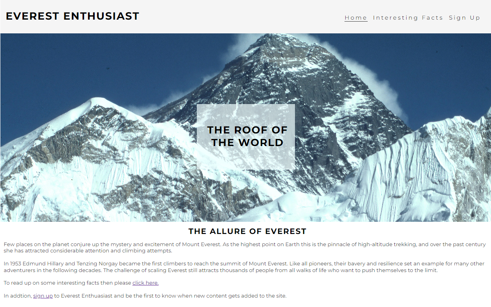
#### Edge test output
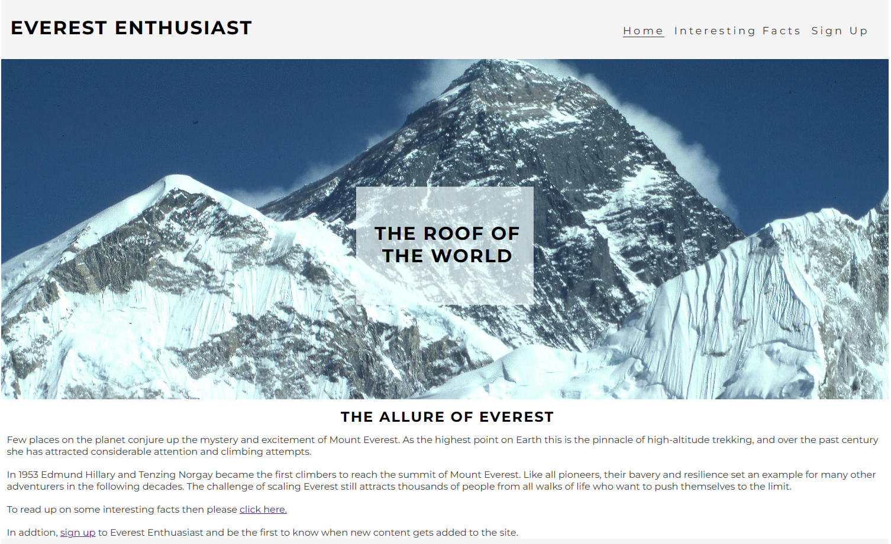
#### Safari test output
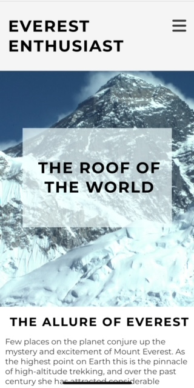

### Responsiveness Testing
|Device Tested|Site Responsive <699px|Site Responsive >=700px|Test Outcome|
|:----|:----|:----|:----|
|I-phone 13|Yes|N/A|Pass|
|Galaxy Fold|Yes|N/A|Pass|
|I-Pad Mini|N/A|Yes|Pass|
|Laptop|N/A|Yes|Pass|
|Desktop|N/A|Yes|Pass|

### Code validation
|Page Tested|Screenshot of Errors|Solution Applied|Screenshot of Clear Validator Output|Test Outcome|
|:----|:----|:----|:----|:----|
|Home-HTML|N/A|N/A|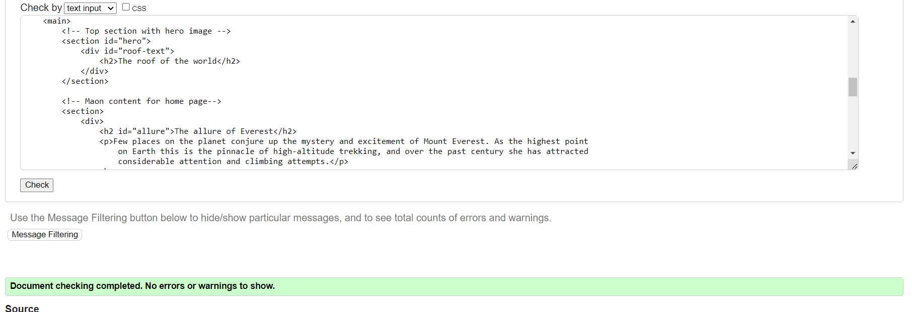|Pass|
|Interesting-Facts-HTML|N/A|N/A|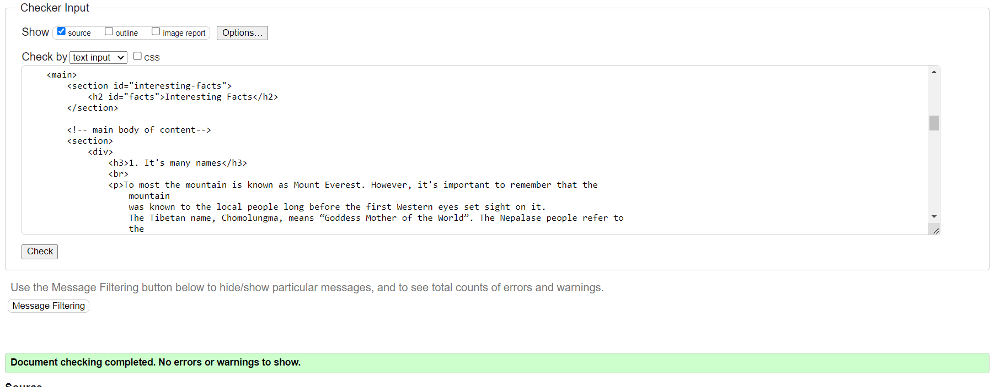|Pass|
|Sign-Up-HTML|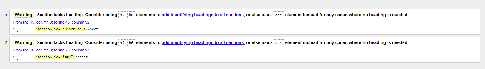|Removed id from section element and applied to div element 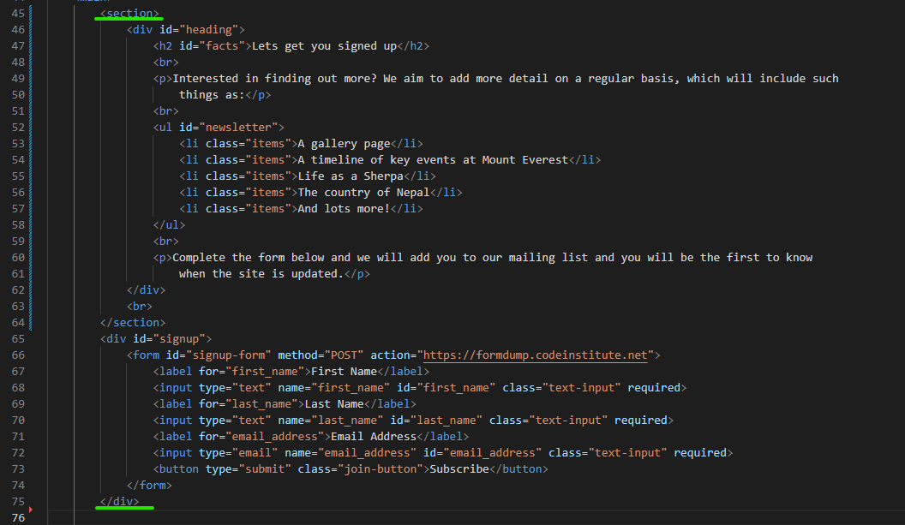|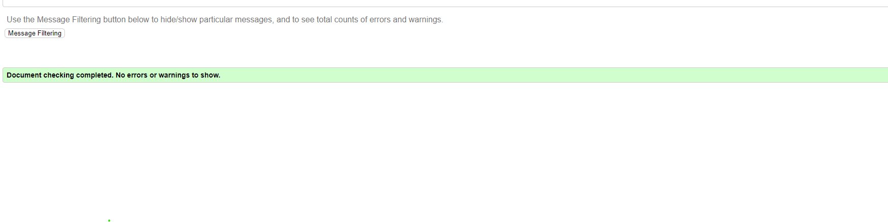|Pass
|CSS|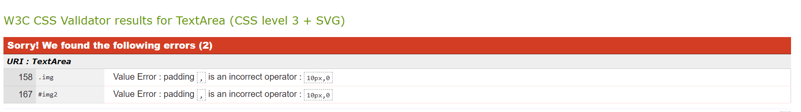|Removed comma between padding values 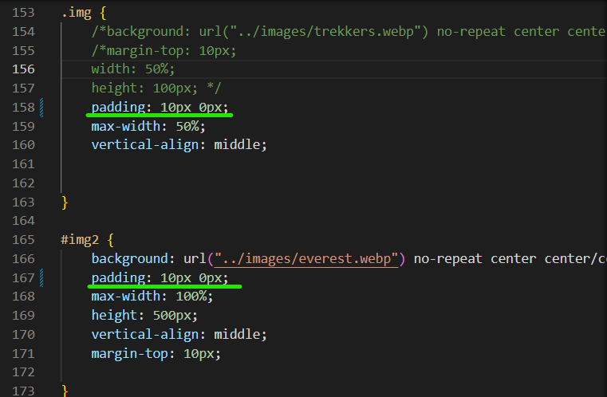||Pass|

### Bugs
|Bug|Description|Solution applied|Result|
|:----|:----|:----|:----|
|Text1|Text2|Text3|Text4|
|Text1|Text2|Text3|Text4|
|Text1|Text2|Text3|Text4|
|Text1|Text2|Text3|Text4|

*Identifying bugs
*Bugs resolved

### Lighthouse Testing
|View Tested|Outcome of the audit|Solution applied|Screenshot of clear Validator output|
|:----|:----|:----|:----|
|Samsung Fold|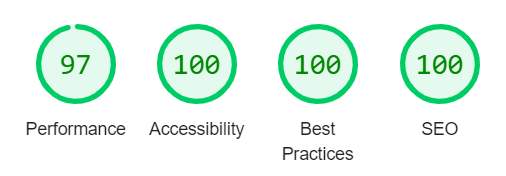|N/A||
|Ipad Mini|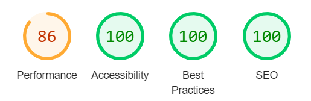|N/A||
|Laptop 1440px||N/A|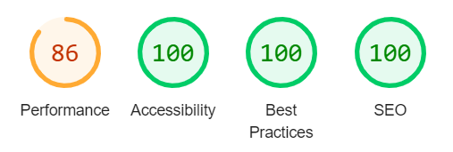|
|4k 2560px|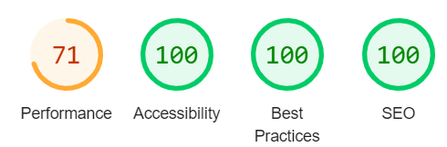|N/A||

### Accessibility Testing
|Accessibility Test|Outcome of Test|
|:----|:----|
|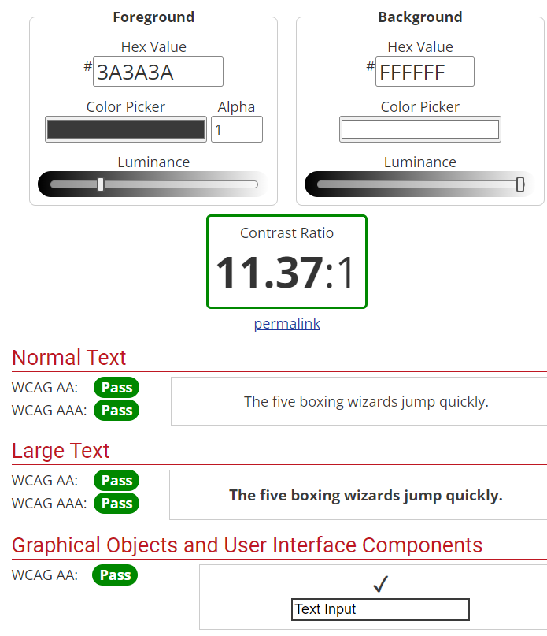|Pass|

## Deployment placeholder
Step by step process for deployment 

## Credit placeholder
Acknowledgement of resources used
Link to resources
Code Institute walkthroughs
Slack support 
WebAIM contrast checker

 

 

[def]: assets/media/edge-test.pgg